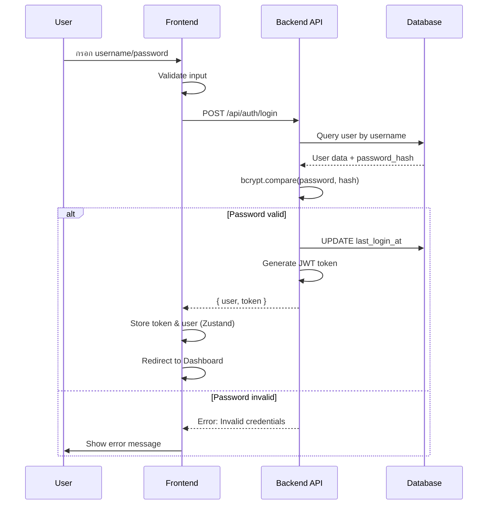
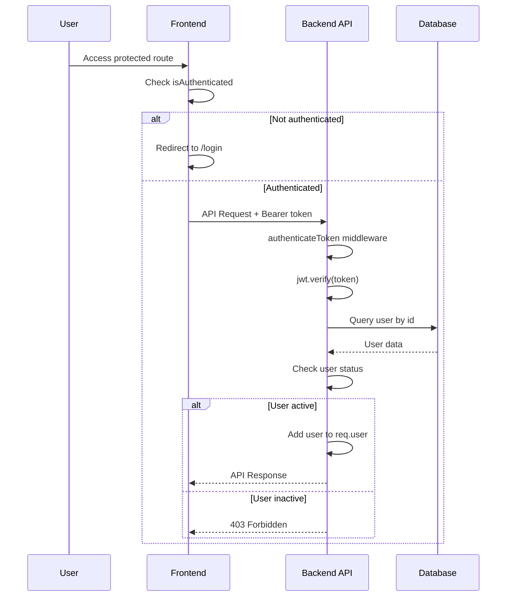
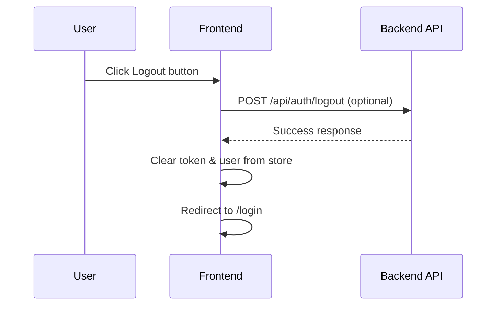

# 🔐 Authentication System Documentation - BMU Work Management System

## 📋 Overview

เอกสารนี้อธิบายระบบ Authentication ทั้งหมดของ BMU Work Management System รวมถึง:
- Backend API
- Frontend Components
- Authentication Flow
- Security Features

## 🏗️ Architecture

### System Components

```
┌─────────────────┐         ┌─────────────────┐         ┌─────────────────┐
│   Frontend      │         │   Backend API   │         │    Database     │
│   (React)       │◄───────►│   (Express)     │◄───────►│   (MySQL)       │
└─────────────────┘         └─────────────────┘         └─────────────────┘
      │                              │                            │
      │                              │                            │
      ▼                              ▼                            ▼
┌─────────────┐            ┌─────────────┐            ┌─────────────┐
│ Auth Store  │            │ JWT Token   │            │ Users Table │
│ (Zustand)   │            │ (jsonwebtoken)│          │             │
└─────────────┘            └─────────────┘            └─────────────┘
```

## 🔄 Authentication Flow

### 1. Login Flow



### 2. Protected Route Flow



### 3. Logout Flow



## 🔧 Backend API

### File Structure

```
backend/
├── config/
│   └── database.js          # Database connection pool
├── middleware/
│   └── auth.js              # JWT authentication middleware
├── routes/
│   └── auth.js              # Authentication routes
└── server.js                # Express server
```

### API Endpoints

#### POST `/api/auth/login`

**Purpose**: Login และรับ JWT token

**Request Body**:
```json
{
  "username": "admin",
  "password": "admin123"
}
```

**Response (Success - 200)**:
```json
{
  "success": true,
  "message": "Login successful",
  "data": {
    "user": {
      "id": "uuid",
      "username": "admin",
      "email": "admin@bmu.local",
      "employee_id": "AC00010",
      "nick_name": "เอ็ม",
      "role": "admin",
      "name": "ยุทธนา (เอ็ม)"
    },
    "token": "eyJhbGciOiJIUzI1NiIsInR5cCI6IkpXVCJ9..."
  }
}
```

**Response (Error - 401)**:
```json
{
  "success": false,
  "message": "Invalid username or password"
}
```

**Response (Error - 403)**:
```json
{
  "success": false,
  "message": "User account is inactive"
}
```

**Process**:
1. Validate input (username, password)
2. Query user จาก database ด้วย username
3. ตรวจสอบ password ด้วย `bcrypt.compare()`
4. ตรวจสอบสถานะ user (active/inactive)
5. อัพเดท `last_login_at`
6. สร้าง JWT token
7. Return user data และ token

#### POST `/api/auth/logout`

**Purpose**: Logout (client-side จะลบ token เอง)

**Headers**:
```
Authorization: Bearer <token>
```

**Response**:
```json
{
  "success": true,
  "message": "Logout successful"
}
```

**Note**: ตอนนี้เป็น stateless logout (client-side ลบ token) แต่สามารถเพิ่ม token blacklist ได้ในอนาคต

#### GET `/api/auth/me`

**Purpose**: ดึงข้อมูล user ปัจจุบัน

**Headers**:
```
Authorization: Bearer <token>
```

**Response**:
```json
{
  "success": true,
  "data": {
    "id": "uuid",
    "username": "admin",
    "email": "admin@bmu.local",
    "employee_id": "AC00010",
    "nick_name": "เอ็ม",
    "role": "admin",
    "name": "ยุทธนา (เอ็ม)"
  }
}
```

**Process**:
1. Verify JWT token (ผ่าน `authenticateToken` middleware)
2. ดึงข้อมูล user จาก `req.user` (set โดย middleware)
3. Return user data

### Middleware

#### `authenticateToken`

**Purpose**: ตรวจสอบ JWT token และเพิ่ม user ข้อมูลใน `req.user`

**Usage**:
```javascript
import { authenticateToken } from './middleware/auth.js'

router.get('/protected-route', authenticateToken, (req, res) => {
  // req.user มีข้อมูล user แล้ว
  res.json({ user: req.user })
})
```

**Process**:
1. ดึง token จาก `Authorization` header
2. Verify token ด้วย `jwt.verify()`
3. Query user จาก database ด้วย `userId` จาก token
4. ตรวจสอบสถานะ user
5. เพิ่ม user ข้อมูลใน `req.user`
6. เรียก `next()` เพื่อไปยัง route handler

#### `authorize(...roles)`

**Purpose**: ตรวจสอบ role ของ user

**Usage**:
```javascript
import { authenticateToken, authorize } from './middleware/auth.js'

router.get('/admin-only', 
  authenticateToken, 
  authorize('admin'), 
  (req, res) => {
    // Only admin can access
  }
)
```

## 🎨 Frontend Components

### File Structure

```
src/
├── pages/
│   └── Login.tsx            # Login page component
├── components/
│   └── Auth/
│       └── ProtectedRoute.tsx  # Route protection component
├── services/
│   ├── api.ts               # Axios instance with interceptors
│   └── authService.ts       # Authentication service functions
└── store/
    └── authStore.ts         # Zustand store สำหรับ auth state
```

### Components

#### Login Page (`src/pages/Login.tsx`)

**Purpose**: หน้า Login สำหรับผู้ใช้

**Features**:
- Form สำหรับกรอก username และ password
- Validation (required fields)
- Error handling และแสดง error messages
- Loading state ขณะ login
- Redirect ไป Dashboard เมื่อ login สำเร็จ

**Process**:
1. User กรอก username และ password
2. Validate input
3. เรียก `authService.login()`
4. เก็บ token และ user ใน `authStore`
5. Redirect ไป `/dashboard`

**Code Flow**:
```typescript
const handleSubmit = async (e: React.FormEvent) => {
  // 1. Validate
  if (!username || !password) {
    setError('กรุณากรอกชื่อผู้ใช้และรหัสผ่าน')
    return
  }

  // 2. Call API
  const response = await authService.login({ username, password })
  
  // 3. Store data
  login(response.data.user, response.data.token)
  
  // 4. Redirect
  navigate('/dashboard')
}
```

#### ProtectedRoute Component (`src/components/Auth/ProtectedRoute.tsx`)

**Purpose**: ป้องกัน routes ที่ต้อง login

**Process**:
1. ตรวจสอบ `isAuthenticated` จาก `authStore`
2. ถ้าไม่ authenticated → Redirect ไป `/login`
3. ถ้า authenticated → แสดง children components

**Usage**:
```tsx
<Route path="/dashboard" element={
  <ProtectedRoute>
    <Dashboard />
  </ProtectedRoute>
} />
```

### Services

#### Auth Service (`src/services/authService.ts`)

**Functions**:

1. **`login(credentials)`**
   - ส่ง POST request ไป `/api/auth/login`
   - Return `{ data: { user, token } }`

2. **`logout()`**
   - ส่ง POST request ไป `/api/auth/logout`
   - Handle errors gracefully

3. **`getCurrentUser()`**
   - ส่ง GET request ไป `/api/auth/me`
   - Return user data

#### API Service (`src/services/api.ts`)

**Features**:
- Axios instance with base URL
- Request interceptor: เพิ่ม Authorization header
- Response interceptor: Handle 401 errors (auto logout)

**Request Interceptor**:
```typescript
api.interceptors.request.use((config) => {
  const token = useAuthStore.getState().token
  if (token) {
    config.headers.Authorization = `Bearer ${token}`
  }
  return config
})
```

**Response Interceptor**:
```typescript
api.interceptors.response.use(
  (response) => response,
  (error) => {
    if (error.response?.status === 401) {
      useAuthStore.getState().logout()
      window.location.href = '/login'
    }
    return Promise.reject(error)
  }
)
```

### State Management

#### Auth Store (`src/store/authStore.ts`)

**Purpose**: จัดการ authentication state ด้วย Zustand

**State**:
- `user: User | null` - ข้อมูล user ปัจจุบัน
- `token: string | null` - JWT token
- `isAuthenticated: boolean` - สถานะ authentication

**Actions**:
- `login(user, token)` - บันทึก user และ token
- `logout()` - ลบ user และ token

**Persistence**:
- ใช้ `zustand/middleware/persist` เพื่อเก็บข้อมูลใน localStorage
- Key: `auth-storage`

## 🔒 Security Features

### 1. Password Security

- **Hashing**: ใช้ bcrypt (cost factor: 10)
- **Storage**: เก็บเฉพาะ hash ใน database
- **Verification**: ใช้ `bcrypt.compare()` ไม่ decrypt

### 2. JWT Token Security

- **Secret Key**: เก็บใน environment variable (`JWT_SECRET`)
- **Expiration**: 7 วัน (ปรับได้ใน `.env`)
- **Storage**: เก็บใน localStorage (Frontend)
- **Transmission**: ส่งผ่าน Authorization header

### 3. API Security

- **CORS**: จำกัด origin ที่อนุญาต
- **Input Validation**: ตรวจสอบ input ก่อน query database
- **Error Handling**: ไม่เปิดเผยข้อมูล sensitive ใน error messages
- **Status Check**: ตรวจสอบสถานะ user (active/inactive)

### 4. Frontend Security

- **Protected Routes**: ป้องกัน routes ที่ต้อง login
- **Auto Logout**: Logout อัตโนมัติเมื่อ token หมดอายุ (401)
- **Token Storage**: เก็บ token ใน localStorage (สามารถเปลี่ยนเป็น httpOnly cookie ได้)

## 📊 Database Schema

### Users Table

```sql
CREATE TABLE users (
  id VARCHAR(36) PRIMARY KEY,
  username VARCHAR(50) UNIQUE NOT NULL,
  email VARCHAR(100) UNIQUE NOT NULL,
  password_hash VARCHAR(255) NOT NULL,
  employee_id VARCHAR(20) NULL,
  nick_name VARCHAR(100) NULL,
  role ENUM('admin', 'data_entry', 'data_entry_and_service', 'audit', 'service') NOT NULL,
  name VARCHAR(100) NOT NULL,
  status ENUM('active', 'inactive') DEFAULT 'active',
  last_login_at DATETIME NULL,
  created_at TIMESTAMP DEFAULT CURRENT_TIMESTAMP,
  updated_at TIMESTAMP DEFAULT CURRENT_TIMESTAMP ON UPDATE CURRENT_TIMESTAMP,
  deleted_at TIMESTAMP NULL
);
```

## 🧪 Testing

### Manual Testing

1. **Login Test**:
   ```bash
   curl -X POST http://localhost:3001/api/auth/login \
     -H "Content-Type: application/json" \
     -d '{"username":"admin","password":"admin123"}'
   ```

2. **Get Current User Test**:
   ```bash
   curl -X GET http://localhost:3001/api/auth/me \
     -H "Authorization: Bearer YOUR_TOKEN"
   ```

3. **Frontend Test**:
   - เปิด `http://localhost:5173/login`
   - กรอก username: `admin`, password: `admin123`
   - ตรวจสอบว่า login สำเร็จและ redirect ไป Dashboard

### Test Cases

#### Login Tests

1. ✅ **Valid Credentials**: Login สำเร็จ
2. ✅ **Invalid Username**: แสดง error "Invalid username or password"
3. ✅ **Invalid Password**: แสดง error "Invalid username or password"
4. ✅ **Empty Fields**: แสดง error "กรุณากรอกชื่อผู้ใช้และรหัสผ่าน"
5. ✅ **Inactive User**: แสดง error "User account is inactive"

#### Protected Route Tests

1. ✅ **Authenticated User**: เข้าถึงได้
2. ✅ **Unauthenticated User**: Redirect ไป `/login`
3. ✅ **Expired Token**: Auto logout และ redirect ไป `/login`

#### Logout Tests

1. ✅ **Logout Success**: ลบ token และ redirect ไป `/login`
2. ✅ **Logout After Token Expired**: Handle gracefully

## 🚀 Deployment

### Environment Variables

**Backend** (`.env`):
```env
DB_HOST=your-db-host
DB_PORT=3306
DB_USER=your-db-user
DB_PASSWORD=your-db-password
DB_NAME=bmu_work_management
JWT_SECRET=your-super-secret-key
PORT=3001
NODE_ENV=production
CORS_ORIGIN=https://your-frontend-domain.com
```

**Frontend** (`.env`):
```env
VITE_API_BASE_URL=https://your-backend-api.com/api
```

### Security Checklist

- [ ] เปลี่ยน `JWT_SECRET` เป็นค่าใหม่ที่ปลอดภัย
- [ ] ตั้งค่า `NODE_ENV=production`
- [ ] ตั้งค่า `CORS_ORIGIN` ให้ตรงกับ Frontend domain
- [ ] ใช้ HTTPS สำหรับ production
- [ ] ตั้งค่า Database credentials ที่ปลอดภัย
- [ ] Enable rate limiting สำหรับ login endpoint
- [ ] ตั้งค่า token expiration ที่เหมาะสม

## 📝 Notes

### Current Limitations

1. **Token Blacklist**: ยังไม่มี token blacklist (stateless logout)
2. **Refresh Token**: ยังไม่มี refresh token mechanism
3. **Rate Limiting**: ยังไม่มี rate limiting สำหรับ login
4. **2FA**: ยังไม่มี Two-Factor Authentication

### Future Improvements

1. ✅ เพิ่ม refresh token mechanism
2. ✅ เพิ่ม token blacklist สำหรับ logout
3. ✅ เพิ่ม rate limiting
4. ✅ เพิ่ม 2FA (ถ้าต้องการ)
5. ✅ เพิ่ม password reset functionality
6. ✅ เพิ่ม account lockout หลัง login ล้มเหลวหลายครั้ง

---

**Last Updated**: 2026-01-29  
**Version**: 1.0.0
